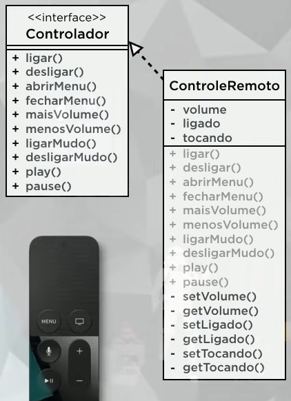

Crie uma classe Controle Remoto que tenha os atributos volume, ligado, tocando.

 A classe Controle Remoto deve implementar a interface Controlador. que deve conter os métos: ligar, desligar, abri menu, fechar menu, mais volume, menos volume, ligar mudo, desligar mudo, play e pause.

Lembre-se de criar os métodos acessores, modificadores e contrutores.

Por padrão, sempre que o dispositivo for ligado, ele estará com o volume em 50 e não estará tocando.

