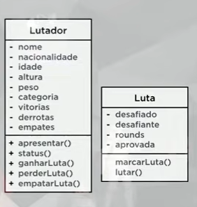
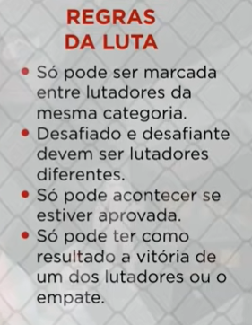

Para este exercício crie uma classe Lutador que tenha como atributos:
nome, nacionalidade, idade, altura, peso, categoria, vitórias, derrotas, e empates. 

Além disso, essa classe terá os métodos apresentar, status, ganhar luta, perder luta e empatar luta.

